# Clawd 小螃蟹形象生成器

Claude 吉祥物 **Clawd** 的像素风形象系统。一个 Claude Code Skill，让你在对话中用自然语言生成、装扮、动画化小螃蟹。

纯代码渲染，零外部依赖，零图片素材。

  

---

## 它能做什么

### 1. 形象生成 — 终端里直接出图

在终端里用 ANSI 真彩色半块字符渲染 Clawd 的像素画。15 种帽子、27 种道具、3 种面部配饰、27 种身体颜色，随意组合。

```bash
bash scripts/render.sh --hat straw --prop vest        # 路飞
bash scripts/render.sh --hat wizard --accessory potter  # 哈利波特
bash scripts/render.sh --hat ninja --prop rasengan      # 鸣人
```

| 经典 | 路飞 | 哈利波特 | 鸣人 | 索隆 |
|:---:|:---:|:---:|:---:|:---:|
| 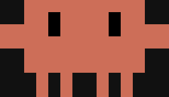 | 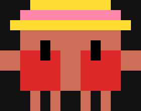 | 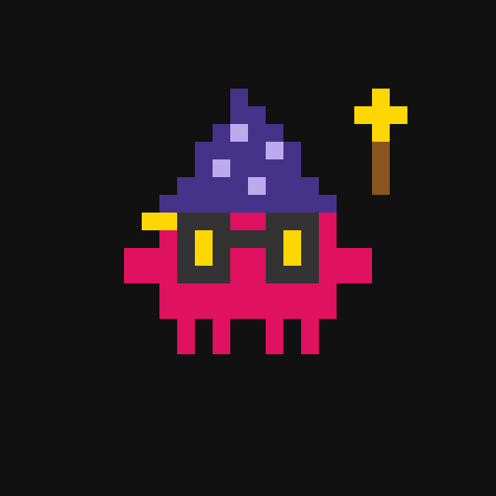 | 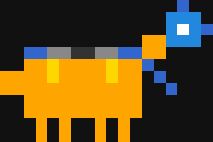 | 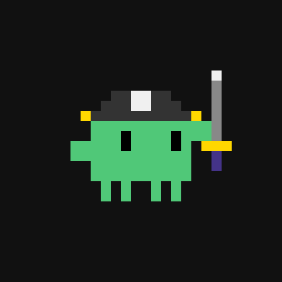 |

| 晓组织 | 草裙舞 | 圣诞节 | 国王 | 程序员 |
|:---:|:---:|:---:|:---:|:---:|
| 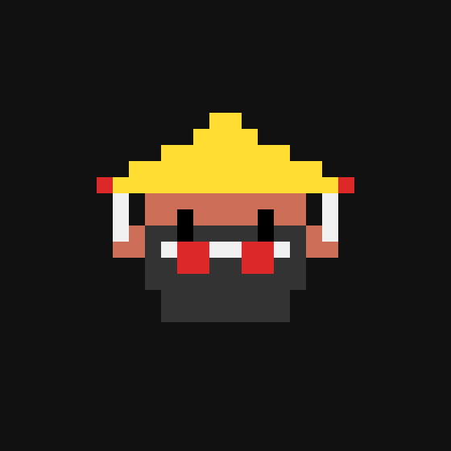 | 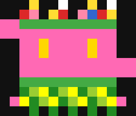 | 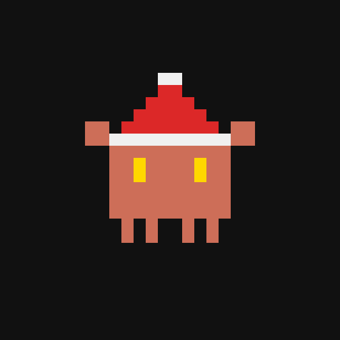 | 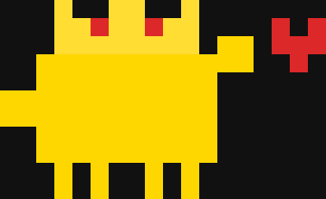 | 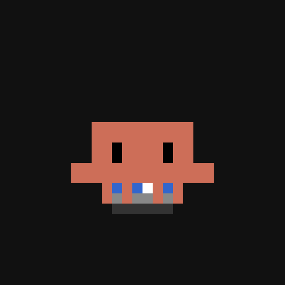 |

还能导出为 HTML 或 PNG：

```bash
bash scripts/render.sh --hat crown --html output.html  # 浏览器预览
bash scripts/render.sh --hat crown --png output.png     # 导出图片
```

---

### 2. HTML 动画 — 单角色像素风动画

跟 Claude 说「让小螃蟹吃冰淇淋」或「小螃蟹在下雨天撑伞」，它会生成一个自包含 HTML 文件，浏览器打开就能看动画。

- 720×720 画布，30 FPS 无缝循环
- 支持多阶段剧情编排（发现 → 靠近 → 互动 → 反应）
- 粒子效果、对话气泡、情绪表达
- 单 HTML 文件，零依赖

| 吃冰淇淋 | 收到爱心 |
|:---:|:---:|
| 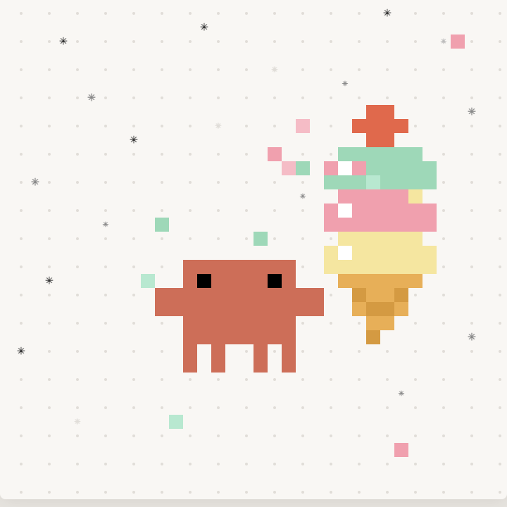 | 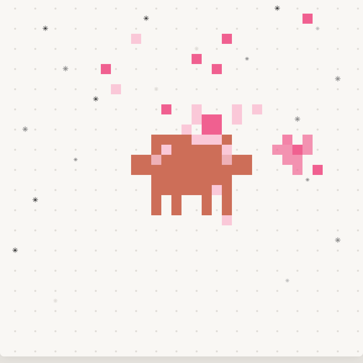 |

---

### 3. 像素全景大场景 — 多角色互动

跟 Claude 说「画个春游大场景，很多螃蟹在公园里」，它会生成一个完整的像素风全景图：

- **1440×1920 画布**（3:4 竖版），固定镜头，一眼看全
- **60+ 只螃蟹**做不同的事：赏花、野餐、钓鱼、放风筝、打篮球、做瑜伽、弹吉他、遛狗、逛集市...
- **丰富地形**：湖泊、河流、桥梁、小溪、花园
- **建筑设施**：咖啡馆、凉亭、游乐场、篮球场、集市摊位
- **动态细节**：流水波纹、樱花花瓣、落叶、喷泉水花、蝴蝶
- **边缘延伸**：建筑和角色被画面边缘截断，世界在画面外继续

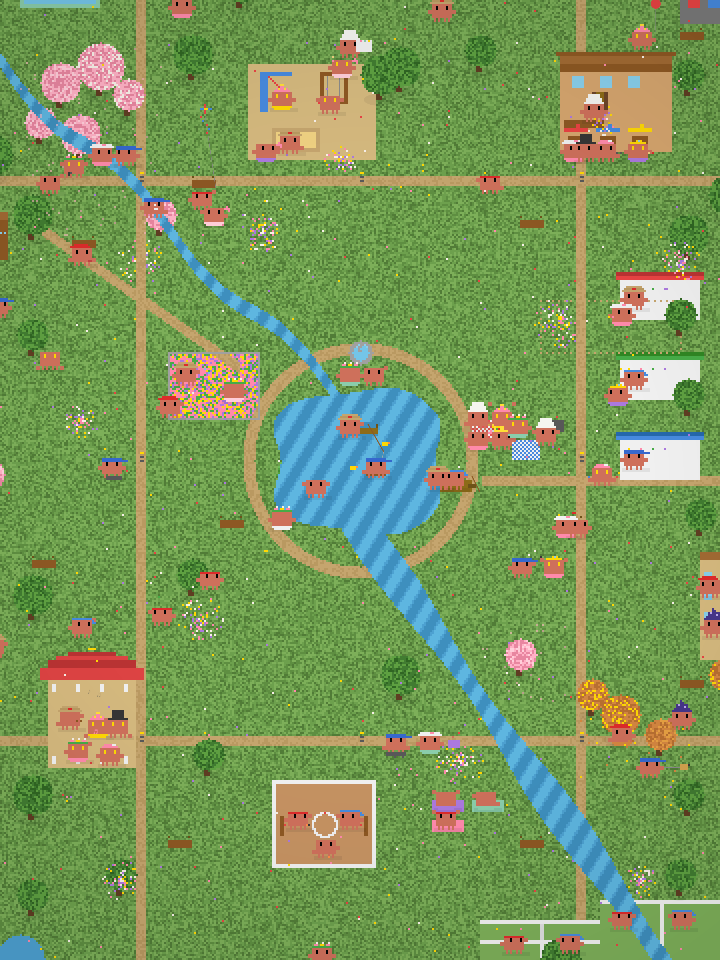

---

## 安装

```bash
# 作为 Claude Code Skill 安装
claude install-skill YANZHANLIN/clawd-avatar-skill
```

安装后，在 Claude Code 对话中说「小螃蟹」「clawd」「给螃蟹戴帽子」「画个大场景」就会自动触发。

---

## 参数速查

### 眼睛 (`--eyes`)

| 值 | 效果 |
|----|------|
| `forward` | 正视前方 |
| `right` / `left` | 左右看 |
| `up` / `down` | 上下看 |
| `blink` | 闭眼 |
| `sparkle` | 金色星星眼 |

### 姿势

| 参数 | 说明 | 范围 |
|------|------|------|
| `--armL` | 左手位置（负=举高） | -4 到 +4 |
| `--armR` | 右手位置 | -4 到 +4 |
| `--legs` | 四条腿倾斜 | 逗号分隔 |

### 帽子 (`--hat`)

| 基础 | 动漫系列 |
|------|----------|
| `cap` 棒球帽 | `straw` 草帽（路飞） |
| `crown` 皇冠 | `pirate` 海贼帽 |
| `party` 派对帽 | `wizard` 巫师帽 |
| `chef` 厨师帽 | `sorting` 分院帽 |
| `purple` 紫色礼帽 | `ninja` 忍者护额 |
| `headband` 运动头带 | `akatsuki` 晓组织斗笠 |
| `santa` 圣诞帽 | |
| `flower` 花冠 | |

### 道具 (`--prop`)

| 基础 | 运动 | 春日 |
|------|------|------|
| `heart` 爱心 | `surfboard` 冲浪板 | `hula` 草裙 |
| `ball` 足球 | `dumbbells` 哑铃 | `bouquet` 手捧花 |
| `laptop` 笔记本 | `boxing` 拳击手套 | `lei` 花环 |
| `cake` 蛋糕 | | `butterfly` 蝴蝶 |
| `scarf` 围巾 | | `vest` 马甲 |

| 哈利波特 | 火影忍者 | 海贼王 |
|----------|----------|--------|
| `wand` 魔杖 | `kunai` 苦无 | `katana` 武士刀 |
| `snitch` 飞贼 | `shuriken` 手里剑 | `meat` 大肉腿 |
| `broom` 扫帚 | `rasengan` 螺旋丸 | `flag` 海贼旗 |
| `hpscarf` 围巾 | `cloak` 斗篷 | `barrel` 酒桶 |

### 面部配饰 (`--accessory`)

可以和道具同时使用：`glasses` 圆框眼镜 / `scar` 闪电疤痕 / `potter` 眼镜+疤痕

### 身体颜色 (`--color`)

27 种预设色 + 自定义 hex：

| 暖色 | 冷色 | 紫色 |
|------|------|------|
| `pink` `hotpink` `rose` | `sky` `blue` `sapphire` | `lavender` `violet` `purple` |
| `coral` `peach` `cherry` | `ocean` `turquoise` `teal` | |
| `ruby` `red` `sunset` | `mint` `green` `emerald` | |
| `tangerine` `orange` `amber` | `lime` | |
| `gold` `yellow` `lemon` | | |

自定义：`--color FF6B9D` 或 `--color "#FF6B9D"`

---

## 角色预设

| 角色 | 命令 |
|------|------|
| **路飞** | `--hat straw --prop vest` |
| **索隆** | `--hat pirate --prop katana --color emerald --eyes right` |
| **鸣人** | `--hat ninja --prop rasengan --color orange --armR -3` |
| **晓组织** | `--hat akatsuki --prop cloak` |
| **哈利波特** | `--hat wizard --prop wand --accessory potter` |
| **魁地奇** | `--hat sorting --prop snitch --accessory glasses --color gold` |

---

## 文件结构

```
clawd-avatar-skill/
├── SKILL.md                  # Skill 定义（三模式路由）
├── README.md                 # 本文件
├── assets/                   # 展示截图
├── scripts/
│   └── render.sh             # 核心渲染引擎（690 行 bash）
└── references/
    ├── template.html         # 动画模式模板
    ├── scene-template.html   # 场景模式模板
    ├── ice-cream.html        # 动画参考：多阶段编排
    ├── clawd-kiss.html       # 动画参考：情绪/粒子
    ├── body-data.md          # 身体像素数据
    ├── decorations.md        # 帽子/道具像素数据
    └── presets.md            # 预设参数速查
```

---

## 更新日志

### v2 — 场景模式

- 新增**模式 C：场景模式** — 多角色像素全景大场景
- 1440×1920（3:4）画布，360×480 格网格
- 完整 16×9 Clawd 身体矩阵 + 16 种帽子 + 服装颜色
- 程序化地形：湖泊、河流、小溪、路径（噪声草地）
- 建筑设施：咖啡馆、凉亭、游乐场、篮球场、集市、瑜伽区
- 粒子系统：樱花、秋叶、喷泉
- 水面预计算优化性能
- 边缘延伸设计

### v1 — 首次发布

- 终端模式：ANSI 半块像素画
- 动画模式：单角色 HTML 动画（720×720）
- 15 种帽子、27 种道具、3 种面部配饰、27+ 身体颜色
- 动漫 cosplay 系列：海贼王、火影忍者、哈利波特

---

## 许可证

MIT
